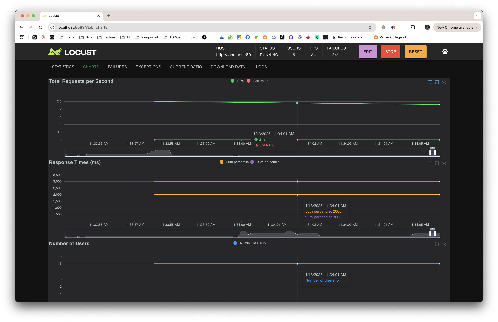
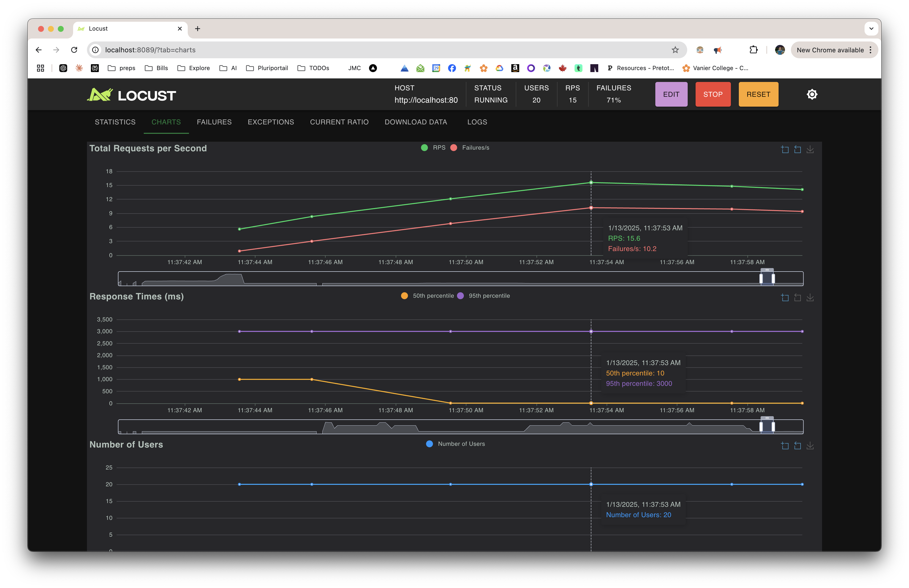

# Load Testing with Locust

This project contains a load testing script using Locust to test a products API endpoint in a dockerized environment.

## Prerequisites

Before you begin, ensure you have the following installed:
- Docker
- Docker Compose
- Python 3.11 or higher (for local development)
- Poetry (for local development)

## Running Tests

### Using Docker (Recommended)

1. Start all services:
```bash
docker-compose up
```

2. Access Locust web interface:
   - Open `http://localhost:8089` in your browser
   - The target host is automatically set to the backend load balancer
   - Set the number of users to simulate
   - Set the spawn rate (users started/second)
   - Click "Start swarming"

3. Stop testing:
```bash
docker-compose down
```

### Local Development

If you prefer to run Locust locally during development:

1. Install Poetry (if not already installed):
```bash
curl -sSL https://install.python-poetry.org | python3 -
```

2. Install dependencies:
```bash
poetry install
```

3. Run Locust:
```bash
poetry run locust
```

# dashboard screenshot in low and high traffic


